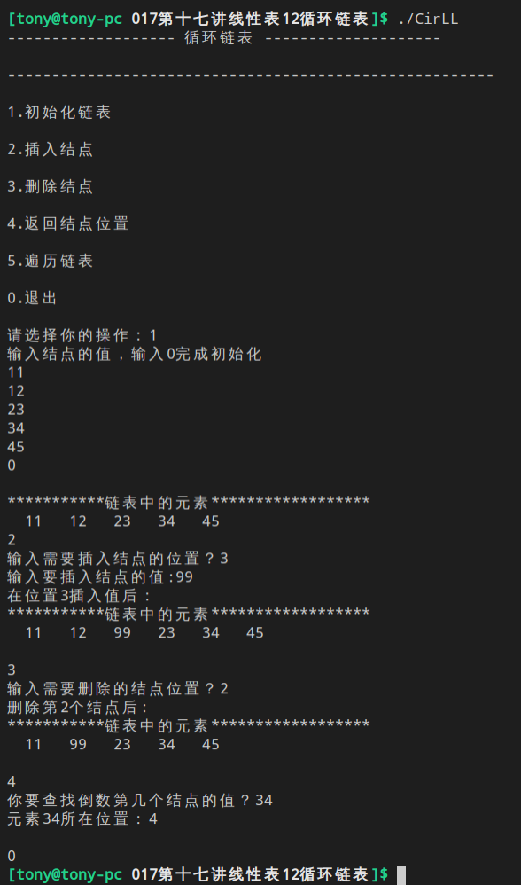
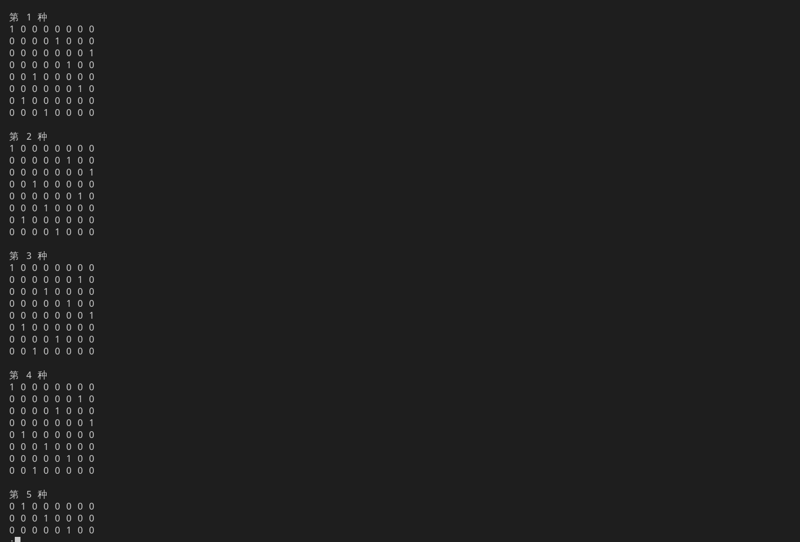
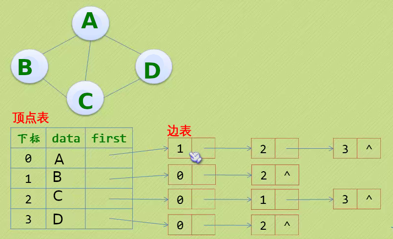

# 小甲鱼数据结构与算法
[在线视频AV版](https://www.bilibili.com/video/av82873471) &emsp; [在线视频BV版](https://www.bilibili.com/video/av82873471)

**[KMP](039第三十九讲KMP算法之实现及优化/kmp2.c)**， **[线索二叉树](049第四十九讲线索二叉树代码实现/main.c)**, **[赫夫曼树](053第五十三讲赫夫曼编码C语言实现/main.cpp)**

## 一、谈谈算法
### 1.算法的基本特征
输入、输出、有穷性、确定性和可行性

### 2、时间复杂度和空间复杂度
#### 1)O()
算法时间复杂度的定义：在进行算法分析时，语句总的执行次数T(n)是关于问题规模n的函数，进而分析T(n)随n的变化情况并确定T(n)的数量级。算法的时间复杂度，也就是算法的时间量度，记作：T(n)= O(f(n))。它表示随问题规模n的增大，算法执行时间的增长率和f(n)的增长率相同，称作算法的渐近时间复杂度，简称为时间复杂度。其中f(n)是问题规模n的某个函数。

**关键需要知道执行次数==时间**
一般情况下，随着输入规模n的增大，T(n)增长最慢的算法为最优算法。

## 二、线性表
### 1.基础概念
#### 1)线性表（List）
线性表（List）：由零个或多个数据元素组成的有限序列。

#### 2)头结点
头结点的数据域不存放任何信息。

### 2.顺序表
[定义结点](008第八讲线性表3顺序表——读取元素、插入操作/list.h)<br>[读取元素](008第八讲线性表3顺序表——读取元素、插入操作/getElem.c) &emsp;[插入元素](008第八讲线性表3顺序表——读取元素、插入操作/ListInsert.c) &emsp; [删除元素](009第九讲线性表4顺序表——删除操作/ListDelete.c)

### 3.单链表
[定义结点](010第十讲线性表5单链表——读取元素/node.h)<br>[读取元素](010第十讲线性表5单链表——读取元素/getElem.c) &emsp; [删除元素](011第十一讲线性表6单链表——插入、删除/ListDelete.c) &emsp; [插入元素](011第十一讲线性表6单链表——插入、删除/ListInsert.c) &emsp; [头插法](012第十二讲线性表7单链表/head_insert.c) &emsp; [尾插法](012第十二讲线性表7单链表/tail_insert.c) &emsp; [清空链表](013第十三讲线性表8单链表/ClearList.c)

### 4.静态链表——用数组描述链表
用数组描述的链表叫做静态链表，这种描述方法叫做游标实现法。

游标|5<br>(备用链表的第一个结点的下标)|2|3|4|0<br>(指向第一个链表)|6|7|...|1<br>(第一个有数值的元素的下标)
:-:|:-:|:-:|:-:|:-:|:-:|:-:|:-:|:-:|:-:
数据| |A|C|D|E| | |...| 
下标|0|1|2|3|4|5|6|...|999

[定义结点](014第十四讲线性表9静态链表/node.h)<br>[寻找备用链表头](015第十五讲线性表10静态链表/getmalloc.c) &emsp; [静态链表长度](015第十五讲线性表10静态链表/getLength.c)<br>[初始化](014第十四讲线性表9静态链表/InitList.c) &emsp; [插入元素](015第十五讲线性表10静态链表/ListInsert.c) &emsp; [删除元素](016第十六讲线性表11单链表小结/ListDelete.c)

- 我们对数组的第一个和最后一个元素做特殊处理，他们的data不存放数据。
- 我们通常把未使用的数组元素称为备用链表。
- 数组的第一个元素，即下标为0的那个元素的cur(游标)就存放备用链表的第一个结点的下标。
- 数组的最后一个元素，即下标为MAXSIZE-1的cur则存放第一个有数值的元素的下标，相当于单链表中的头结点作用。

静态链表不是一定挨着的，中间可能有空

游标|2|5|6|4|0|3|7|...|1
:-:|:-:|:-:|:-:|:-:|:-:|:-:|:-:|:-:|:-:
数据| |A| |D|E|B| |...| 
下标|0|1|2|3|4|5|6|...|999

---
##### 腾讯题目：快速找到未知长度单链表的中间节点。

遍历一遍找结果 &emsp;[快慢指针](016第十六讲线性表11单链表小结/腾讯面试题/快慢指针/GetMidNode.c)

[小结](016第十六讲线性表11单链表小结/腾讯面试题/课后作业/getMidNode.c)


### 5.循环链表
将单链表中终端结点的指针端由空指针改为指向头结点。

[定义结点](017第十七讲线性表12循环链表/node.h)<br>[初始化部分](017第十七讲线性表12循环链表/ds_init.c) &emsp; [插入部分](017第十七讲线性表12循环链表/ds_init.c) &emsp; [删除部分](017第十七讲线性表12循环链表/ds_delete.c) &emsp; [返回结点所在位置](017第十七讲线性表12循环链表/ds_search.c) &emsp; [遍历](017第十七讲线性表12循环链表/ds_traverse.c)<br>[主函数](017第十七讲线性表12循环链表/CirLL.c)



---
#### 循环链表应用
##### [约瑟夫问题](018第十八讲线性表13循环链表应用——约瑟夫问题/Josephus.c)
据说著名犹太历史学家 Josephus有过以下的故事：在罗马人占领乔塔帕特后，39个犹太人与Josephus及他的朋友躲到一个洞中，39个犹太人决定宁愿死也不要被敌人抓到，于是决定了一个自杀方式，41个人排成一个圆圈，由第1个人开始报数，每报数到第3人该人就必须自杀，然后再由下一个重新报数，直到所有人都自杀身亡为止。

然而Josephus和他的朋友并不想遵从，Josephus要他的朋友先假装遵从，他将朋友与自己安排在第16个与第31个位置，于是逃过了这场死亡游戏。

##### [连接两个链表](019第十九讲线性表14循环链表/1.连接两个链表/cennect.c)
实现将两个线性表（a1，a2，…，an）和（b1，b2，…，bm）连接成一个线性表（a1，…，an，b1，…bm）的运算。

###### 分析：
若在单链表或头指针表示的单循环表上做这种链接操作，都需要遍历第一个链表，找到结点an，然后将结点b1链到an的后面，其执行时间是O(n)。
若在尾指针表示的单循环链表上实现，则只需修改指针，无须遍历，其执行时间是O(1)。

##### [判断单链表是否有环](019第十九讲线性表14循环链表/2.判断环/loop.c)
方法一：使用p、q两个指针，p总是向前走，但q每次都从头开始走，对于每个节点，看p走的步数是否和q一样。如图，当p从6走到3时，用了6步，此时若q从head出发，则只需两步就到3，因而步数不等，出现矛盾，存在环。

方法二：使用p、q两个指针，p每次向前走一步，q每次向前走两步，若在某个时候p == q，则存在环。


##### [魔术师发牌问题](020第二十讲线性表15循环链表应用——魔术师拉丁方针/1.魔术师发牌问题/Magician.c)
问题描述：魔术师利用一副牌中的13张黑牌，预先将他们排好后叠放在一起，牌面朝下。对观众说：“我不看牌，只数数就可以猜到每张牌是什么，我大声数数，你们听，不信？现场演示。”魔术师将最上面的那张牌数为1，把他翻过来正好是黑桃A，将黑桃A放在桌子上，第二次数1,2，将第一张牌放在这些牌的下面，将第二张牌翻过来，正好是黑桃2，也将它放在桌子上这样依次进行将13张牌全部翻出，准确无误。

问题：牌的开始顺序是如何安排的？

##### [拉丁方阵问题](020第二十讲线性表15循环链表应用——魔术师拉丁方针/2.拉丁方阵问题/latin.c)
拉丁方阵是一种n×n的方阵，方阵中恰有n种不同的元素，每种元素恰有n个，并且每种元素在一行和一列中 恰好出现一次。著名数学家和物理学家欧拉使用拉丁字母来作为拉丁方阵里元素的符号，拉丁方阵因此而得名。

例如下图是一个3×3的拉丁方阵：

1|2|3
:-:|:-:|:-:
2|3|1
3|1|2

### 6.双向链表
[定义结点](021第二十一讲线性表16双向链表/node.h)<br>[插入](021第二十一讲线性表16双向链表/Insert.c) &emsp; [删除](021第二十一讲线性表16双向链表/ListDelete.c)

---
#### 双向链表应用
##### [链表逆序输出](021第二十一讲线性表16双向链表/1.链表逆序输出/test.c)

### 7.双向循环链表
---
#### 双向循环链表应用
##### [凯撒加密](022第二十二讲线性表17双向循环链表/1.给定起始位置输出/main.c)
要求实现用户输入一个数使得26个字母的排列发生变化，例如用户输入3，输出结果：```DEFGHIJKLMNOPQRSTUVWXYZABC```

同时需要支持负数，例如用户输入-3，输出结果：```XYZABCDEFGHIJKLMNOPQRSTUVW```


##### [Vigenere（维吉尼亚）加密](022第二十二讲线性表17双向循环链表/2.Vigenere/main.c)
凯撒加密的弊端就是利用**概率论**的方法破解。人们在单一恺撒密码的基础上扩展出多表密码，称为“维吉尼亚”密码。维吉尼亚密码引入了 **“密钥”**的概念，即根据密钥来决定用哪一行的密表来进行替换，以此来对抗字频统计。

当输入明文，自动生成随机密匙匹配明文中每个字母并移位加密。

> 为了掩盖字母使用中暴露的频率特征，解决的办法就是用多套符号代替原来的文字。

明文|I|L|O|V|E|F|I|S|H|C
:-:|:-:|:-:|:-:|:-:|:-:|:-:|:-:|:-:|:-:|:-:
随机密匙|3|15|23|2|52|1|33|49|13|19
密文|L|	A|L|X|E|G|P|P|U|V

- 建议：当然你的随机密匙生成后不能丢掉，丢掉了就很难把明文还原来了，建议把随机密匙和密文加密存储在一起。


### 8.栈——一般更愿意顺序存储
栈（Stack）是一个后进先出（Last in first out,LIFO）的线性表，它要求只在表尾进行删除和插入操作。
#### 1)栈的顺序存储结构
[定义结点](023第二十三讲栈和队列顺序栈/sqnode.h)<br>[初始化](023第二十三讲栈和队列顺序栈/Init.c) &emsp; [入栈](023第二十三讲栈和队列顺序栈/push.c) &emsp; [出栈](023第二十三讲栈和队列顺序栈/pop.c) &emsp; [清空](024第二十四讲栈和队列2顺序栈/clear.c) &emsp; [销毁](024第二十四讲栈和队列2顺序栈/DestoryStack.c) &emsp; [求长度](024第二十四讲栈和队列2顺序栈/stacklen.c)

---
#### 顺序栈应用
##### [二进制转十进制](025第二十五讲栈和队列3应用进制转换/1.二进制转十进制/main.c)  &emsp; [二进制转八进制](025第二十五讲栈和队列3应用进制转换/2.二进制转八进制/bin2oct.c) &emsp; [二进制转十六进制](025第二十五讲栈和队列3应用进制转换/3.二进制转十六进制/bin2Hexc.)
利用栈的数据结构特点，将二进制转换为十进制数。


##### [括号匹配](025第二十五讲栈和队列3应用进制转换/4.括号匹配/main.c)
假设数学表达式中允许包含两种括号:圆括号“()”和方括号“[]”，嵌套顺序任意。

#### 2)栈的链式存储结构
[定义结点](026第二十六讲栈和队列4链栈/stackNode.h) &emsp; [定义栈表结构](026第二十六讲栈和队列4链栈/LinkStack.h)<br>


[判断是否为空](026第二十六讲栈和队列4链栈/stackempty.c) &emsp; [压栈](026第二十六讲栈和队列4链栈/push.c) &emsp; [出栈](026第二十六讲栈和队列4链栈/pop.c)

---
#### 链栈应用
##### [逆波兰表达式, RPN](027第二十七讲栈和队列5/RPN.c)
对于```(1-2)*(4+5)```，如果用逆波兰表示法，应该是这样：```1 2 – 4 5 + * ```


##### [中缀表达式转换为后缀表达式](028第二十八讲栈和队列6表达式/M2L.c)


### 9.队列——一般更愿意链式存储
#### 1)队列的顺序存储结构——循环队列
因为队列会出现数组溢出，所以让尾重新指向头。只要```rear```不与```front```重合都不满——取模%QueueSize


[定义循环队列](030第三十讲栈和队列8循环队列/CycleQueue.h)<br>[初始化](030第三十讲栈和队列8循环队列/Init.c) &emsp; [入队](030第三十讲栈和队列8循环队列/Insert.c) &emsp; [出队](030第三十讲栈和队列8循环队列/Delete.c)


#### 2)队列的链式存储结构
[定义结点](029第二十九讲栈和队列7队列/Qnode.h) &emsp; [定义队列结构](029第二十九讲栈和队列7队列/LinkQueue.h)<br>


[入队](029第二十九讲栈和队列7队列/Init.c) &emsp; [出队](029第二十九讲栈和队列7队列/Delete.c) &emsp; [销毁队列](029第二十九讲栈和队列7队列/Destory.c)


### 10.递归与分治思想
递归是一个效率很低的算法，不到万不得已不要使用递归——用**迭代**。

---
#### 递归与分治应用
##### [谢尔宾斯基(Sierpinski)三角形](031第三十一讲递归和分治思想/Sierpinski_triangle/main.c)
其生成过程为:
- 取一个实心的三角形。（多数使用等边三角形）
- 沿三边中点的连线，将它分成四个小三角形。
- 去掉中间的那一个小三角形。
- 对其余三个小三角形重复1。

##### 斐波那契
如果说兔子在出生两个月后，就有繁殖能力，一对兔子每个月能生出一对小兔子来。假设所有兔子都不会死去，能够一直干下去，那么一年以后可以繁殖多少对兔子呢？

[迭代法](031第三十一讲递归和分治思想/Fibonacci/Iteration/Iteration.c)<br>

[递归法](031第三十一讲递归和分治思想/Fibonacci/Recursion/Recursion.c)<br>

##### [计算n的阶乘](032第三十二讲递归和分治思想2/factorial/factorial.c)


##### [递归反向输出字符串](032第三十二讲递归和分治思想2/Recursion_output/main.c)
编写一个递归函数，实现将输入的任意长度的字符串反向输出的功能。


##### [递归折半查找](032第三十二讲递归和分治思想2/bin_search/main.c)
[分析](https://fishc.com.cn/thread-27964-1-1.html)

##### [汉诺塔游戏](033第三十三讲递归和分治思想3汉诺塔/hanno.c)
在世界中心贝拿勒斯的圣庙里，一块黄铜板上插着三根宝石针。印度教的主神梵天在创造世界的时候，在其中一根针上从下到上地穿好了由大到小的64片金片，这就是所谓的汉诺塔。不论白天黑夜，总有一个僧侣在按照下面的法则移动这些金片：一次只移动一片，不管在哪根针上，小片必须在大片上面。


##### [八皇后问题](034第三十四讲递归和分治思想4八皇后问题/EightQueen.c)
该问题是十九世纪著名的数学家高斯1850年提出：
- 在8X8格的国际象棋上摆放八个皇后，使其不能互相攻击，即任意两个皇后都不能处于同一行、同一列或同一斜线上，问有多少种摆法。




### 11.字符串
字符串比较的是大小，不是长短，是ASCII码的大小

#### 1)字符串比较
##### (1)[BF算法](035第三十五讲字符串——BF算法/bf.c)
BF算法属于朴素的模式匹配算法，它的核心思想是：
- 有两个字符串S和T，长度为N和M。首先S[1]和T[1],比较，若相等，则再比较S[2]和T[2]，一直到T[M]为止；若S[1]和T[1]不等，则T向右移动一个字符的位置，再依次进行比较。
- 该算法最坏情况下要进行M*(N-M+1)次比较，时间复杂度为O(M*N)。

##### (2)*KMP算法


## 三、树
结点的子树的根称为结点的孩子(Child)，相应的，该结点称为孩子的双亲(Parent)，同一双亲的孩子之间互称为兄弟(**Sibling**)。
### 1.树的存储结构
#### 1)树顺序存储
##### (1)双亲表示法
[定义结点](041第四十一讲树的存储结构——双亲表示法/PTNode.h) &emsp; [定义树形结构](041第四十一讲树的存储结构——双亲表示法/PTree.h)<br>
<br>
但是这种结构存在很大的问题，就是想知道某结点的孩子就需要全部遍历一遍，所以改进的数据结构是<br>
[定义改进的节点](041第四十一讲树的存储结构——双亲表示法/PTNode2.h)<br>
<br>
如果比较在意兄弟的信息可以这样定义结点 [带有兄弟Sibling的节点定义](041第四十一讲树的存储结构——双亲表示法/PTNode3.h)<br>
<br>

---
存储结构的设计是一个非常灵活的过程，只要你愿意，你可以设计出任何你想要的结构。<br>
一个存储结构设计得是否合理，取决于基于该存储结构的运算是否适合、是否方便，时间复杂度好不好等等。

##### (2)孩子表示法
[定义孩子结点](042第四十二讲树的存储结构2——孩子表示法/CTNode.h) &emsp; [定义表头结构](042第四十二讲树的存储结构2——孩子表示法/CTBox.h) &emsp; [定义树形结构](042第四十二讲树的存储结构2——孩子表示法/Tree.h)<br>
<br>
##### (2)双亲孩子表示法
[定义表头结构](042第四十二讲树的存储结构2——孩子表示法/CTBox2.h) 


##### (3)孩子兄弟表示法——二叉树表示法

### 2.二叉树
#### 链式存储
[定义结点](043第四十三讲二叉树/BitNode.h)

#### 1)遍历二叉树
[先序遍历](047第四十七讲二叉树的建立和遍历算法/1.Preorder/main.c) &emsp; [中序遍历](047第四十七讲二叉树的建立和遍历算法/2.Inorder/main.c) &emsp; [后序遍历](047第四十七讲二叉树的建立和遍历算法/3.Postorder/main.c) &emsp; [层次遍历]()

###### 层次遍历算法
用一个队列保存被访问的当前节点的左右孩子以实现层次遍历。在进行层次遍历的时候，设置一个队列结构，遍历从二叉树的根节点开始，首先将根节点指针入队列，然后从队头取出一个元素，每取一个元素，执行下面两个操作：
- 访问该元素所指向的节点
- 若该元素所指节点的左右孩子节点非空，则将该元素所指节点的左孩子指针和右孩子指针顺序入队。此过程不断进行，当队列为空时，二叉树的层次遍历结束。

#### 2)*线索二叉树
采用**中序遍历**的方式存储。

[线索二叉树定义结点](049第四十九讲线索二叉树代码实现/BiThrTree.h) &emsp; [创建线索二叉树](049第四十九讲线索二叉树代码实现/CreateBiThrTree.c) &emsp; [中序遍历线索化](049第四十九讲线索二叉树代码实现/InThreading.c) &emsp; [中序遍历二叉树](049第四十九讲线索二叉树代码实现/InOrderTraverse.c)<br>


<br>
可以使用```gdb```查看<br>


### 3.树、森林、二叉树转换
树、森林的前根（序）遍历和二叉树的前序遍历结果相同，树、森林的后根（序）遍历和二叉树的中序遍历结果相同！


### 4.树的应用
##### (4)[赫夫曼树](053第五十三讲赫夫曼编码C语言实现/main.cpp)

## 四、图(Grah)
### 1.基本概念
图（Graph）是由顶点的**有穷非空集合**和顶点之间边的集合组成，通常表示为：G(V,E)，其中，G表示一个图，V是图G中顶点的集合，E是图G中边的集合。

无向边：若顶点Vi到Vj之间的边没有方向，则称这条边为**无向边(Edge)**，用**无序偶(Vi,Vj)**来表示。

有向边：若从顶点Vi到Vj的边有方向，则称这条边为有向边，也成为**弧(Arc)**，用**有序偶<Vi,Vj>**来表示，Vi称为弧尾，Vj称为弧头。

简单图：在图结构中，若不存在顶点到其自身的边，且同一条边不重复出现，则称这样的图为简单图。<br>


无向完全图：在无向图中，如果任意两个顶点之间都存在边，则称该图为无向完全图。含有n个顶点的无向完全图有n*(n-1)/2条边。<br>


有向完全图：在有向图中，如果任意两个顶点之间都存在方向互为相反的两条弧，则称该图为有向完全图。含有n个顶点的有向完全图有n*(n-1)条边。<br>


稀疏图和稠密图：这里的稀疏和稠密是模糊的概念，都是相对而言的，通常认为**边或弧数小于n*logn（n是顶点的个数）**的图称为稀疏图，反之称为稠密图。

网(Network):有些图的边或弧带有与它相关的数字，这种与图的边或弧相关的数叫做权(Weight)，带权的图通常称为**网(Network)**。<br>
.png)

假设有两个图G1=(V1,E1)和G2=(V2,E2)，如果V2⊆V1，E2⊆E1，则称G2为G1的子图(Subgraph)。<br>


###### 注意的地方
- 线性表中我们把数据元素叫**元素**，树中叫**结点**，在图中数据元素我们则称之为**顶点(Vertex)**。
- 线性表可以没有数据元素，称为空表，树中可以没有结点，叫做空树，而图结构在咱国内大部分的教材中强调顶点集合V要有穷非空。
- 线性表中，相邻的数据元素之间具有线性关系，树结构中，相邻两层的结点具有层次关系，而图结构中，任意两个顶点之间都可能有关系，顶点之间的逻辑关系用边来表示，边集可以是空的。

### 2.图的存储结构
#### 1)邻接矩阵
##### (1)[无向图](056第五十六讲图的存储结构（邻接矩阵）/1.无向图/main.c)


###### (2)[有向图](056第五十六讲图的存储结构（邻接矩阵）/2.有向图/main.c)


#### 2)邻接表
把数组与链表结合一起来存储，这种方式在图结构也适用，我们称为**邻接表(AdjacencyList)**

##### (1)无向图
###### 不带权值
<br>
[无向图邻接表——不带权值](057第五十七讲图的存储结构（邻接表）/1.无向图/1.不带权值/main.c)<br>

###### 带权值
[无向图邻接表——带权值](057第五十七讲图的存储结构（邻接表）/1.无向图/2.带权值/main.c)<br>


##### (2)有向图


###### 逆邻接表
但也有时为了便于确定顶点的**入度**或以顶点为弧头的弧，我们可以建立一个有向图的逆邻接表：<br>


###### 带权邻接表：
对于带权值的网图，可以在边表结点定义中再增加一个数据域来存储权值即可：


#### 3)十字链表——>针对有向图
核心就是一条边用**弧头**与**弧尾**两个顶点表示<br>
<br>
顶点表结构
- data:顶点相关信息，eg:顶点名称
- firstIn：以该定点为弧头的的第一个弧结点
- firstOut：以该定点为弧尾的的第一个弧结点

边表结构
- tailVex：该边的弧头
- headVex：该边的弧尾
- headLink：弧头相同的下一条弧(即headVex相同的下一条弧)
- tailLink：弧尾相同的下一条弧(即tailVex相同的下一条弧)
- info：弧的信息，eg:弧的权重

十字链表的好处就是因为把邻接表和逆邻接表整合在了一起，这样既容易找到以Vi为尾的弧，也容易找到以Vi为头的弧，因而容易求得顶点的出度和入度。

> 图的十字链表不是唯一的，**但是**一个十字链表可以对应唯一的一个图

#### 4)邻接多重表——>针对无向图
核心就是一条边用边上的**两个顶点**表示<br>
> 有几个边，就有几个边表结构

<br>
顶点表结构
- data:顶点相关信息，eg:顶点名称
- firstedge:指向第一条依附与该顶点的边

边表结构
- mark:标志域，表示该边是否被搜索过。
- iVex：该边的一个顶点 i
- iLink：下一条依附该顶点的边(即**iVex**相同的边)
- jVex：该边的一个顶点 j
- jLink：下一条依附该顶点的边(即**jVex**相同的边)
- info：边的信息，eg:边的权重


#### 5)边集数组


### 3.图的遍历
##### (1)深度遍历(Depth First Search, DFS)
**递归**方法：仔细发现深度遍历的本质是树的**前序遍历**<br>


##### (2)广度遍历(Breadth First Search, BFS)
仔细发现深度遍历的本质是树的**层序遍历**<br>


##### [马踏棋盘算法（骑士周游问题）](034第三十四讲递归和分治思想4八皇后问题/EightQueen.c)
– 国际象棋的棋盘为8*8的方格棋盘，现将“马”放在任意指定的方格中，按照“马”走棋的规则将“马”进行移动。要求每个方格只能进入一次，最终使得“马”走遍棋盘64个方格。
– 编写代码，实现马踏棋盘的操作，要求用1~64来标注“马”移动的路径

.gif)
###### 一些相关的知识点
> 回溯法：
> - 之前我们谈过回溯法，还是那句话，指导思想很简单，就是一条路走到黑，碰壁了再回来一条路走到黑......一般和递归可以很好的搭配使用，还有深度优先搜索（DFS）。
>
> 哈密尔顿路径：
> - 图G中的哈密尔顿路径指的是经过图G中每个顶点，且只经过一次的一条轨迹。如果这条轨迹是一条闭合的路径（从起点出发不重复地遍历所有点后仍能回到起始点），那么这条路径称为哈密尔顿回路。


---
### 4.*图的应用
#### 1)最小生成树
无论是普里姆算法（Prim）还是克鲁斯卡尔算法（Kruskal），他们考虑问题的出发点都是：为使生成树上边的权值之和达到最小，则应使生成树中每一条边的权值尽可能的小。
##### (1)Prim算法

##### (2)Kruskal算法

#### 2)最短路径
##### (1)Dijkstra算法
##### (2)Floyd算法

#### 3)拓扑排序

#### 4)关键路径

## 五、查找
### 1.按比例查找

### 2.线性索引

### 3.二叉排序树

### 4.

## 六、排序


